<header>
<h1>Cera Shop | <a target="_blank" href="https://cera-shop.herokuapp.com">Demo</a></h1>

</header>

<main>
<section>
<h2>Main Pages</h2>
<ul>
<li><h3><a href="#">Home</a></h3></li>

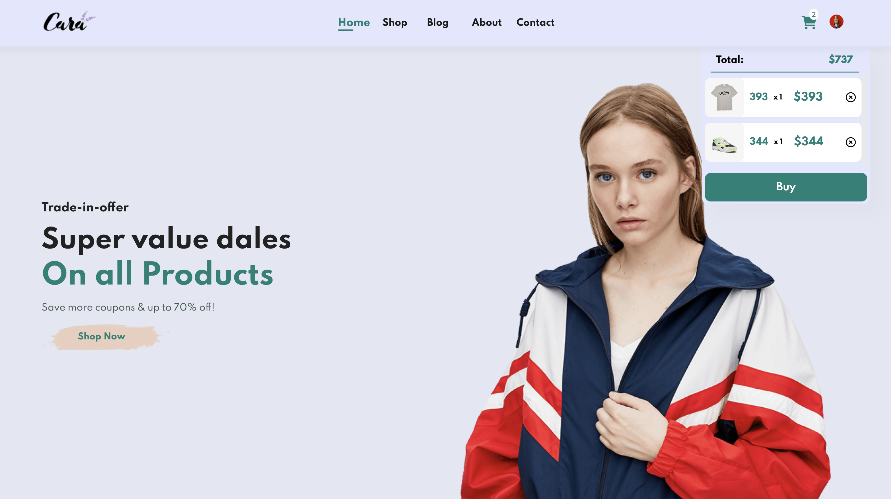
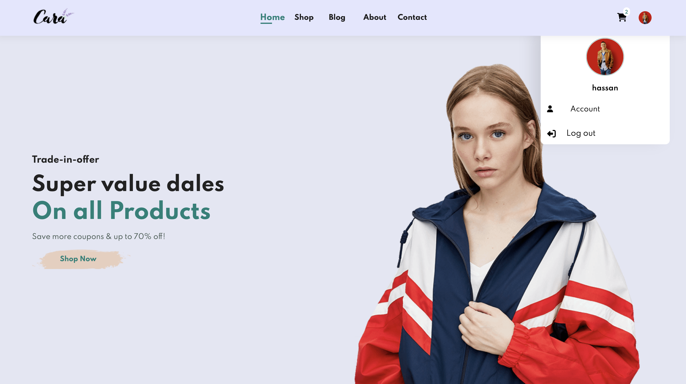
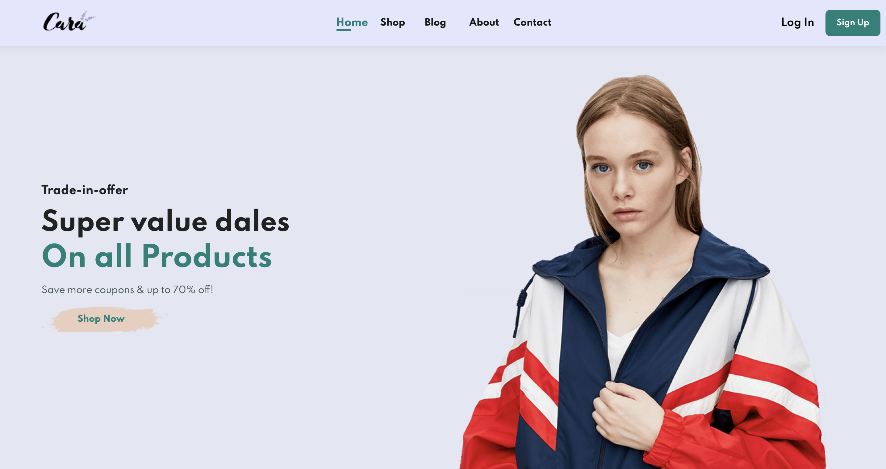
<li><h3><a href="#">Shop</a></h3></li>

<li><h3><a href="#">Product</a></h3></li>
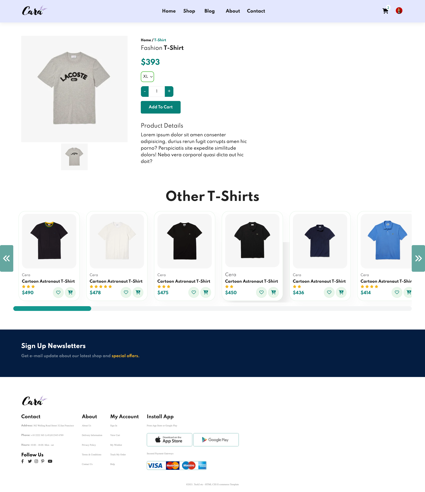
<li><h3><a href="#">Blog</a></h3></li>

<li><h3><a href="#">About</a></h3></li>
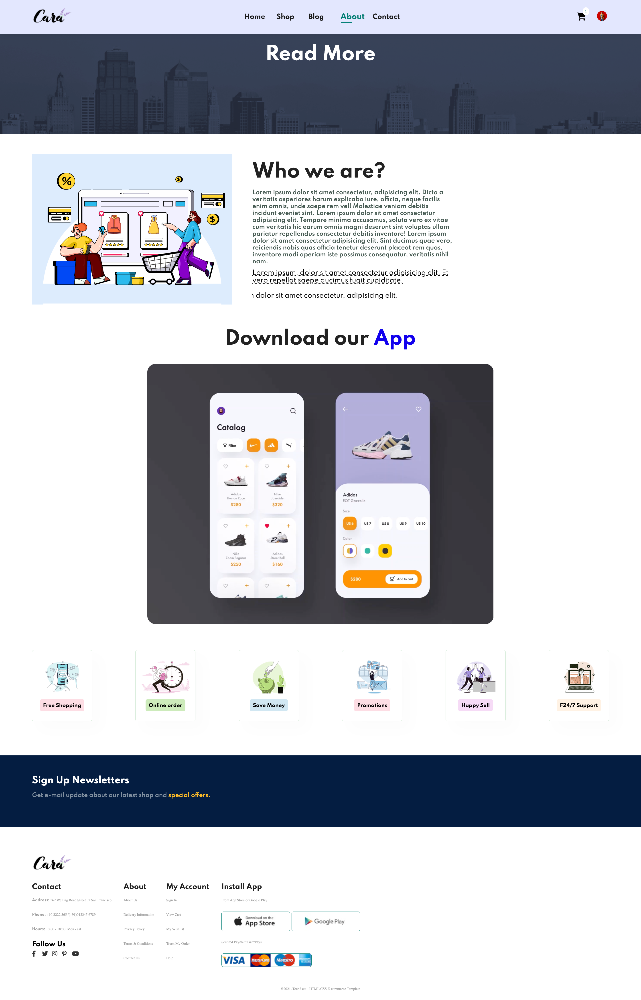
<li><h3><a href="#">Contact</a></h3></li>
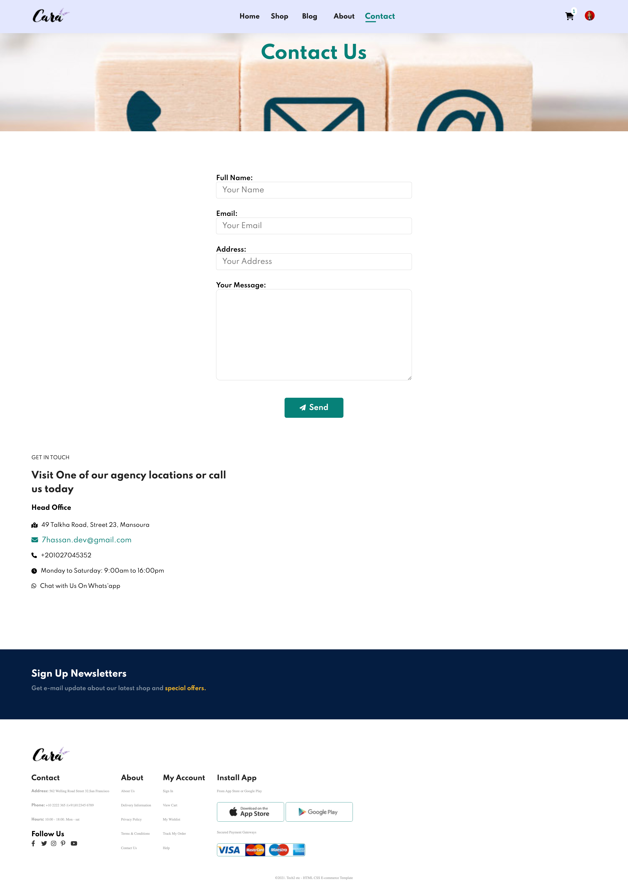
<li><h3><a href="#">Payment</a></h3></li>
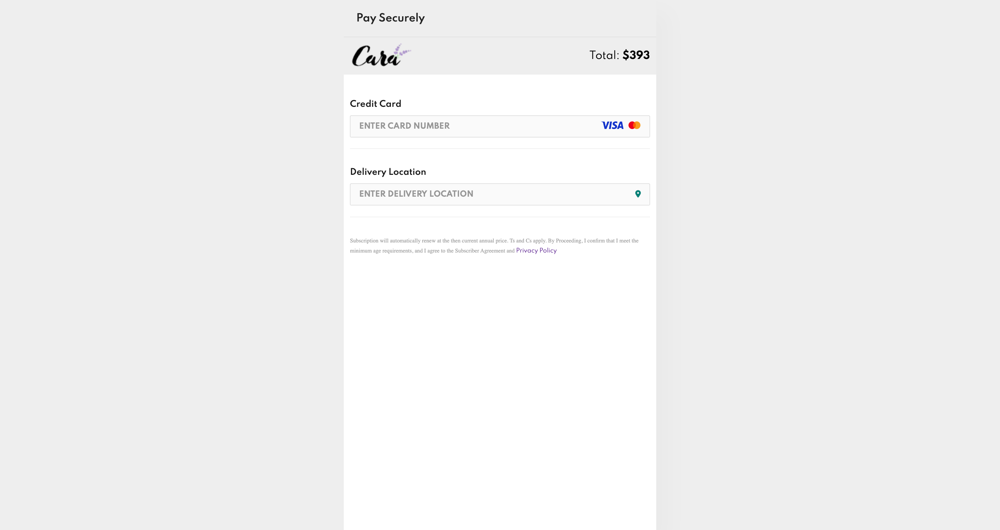
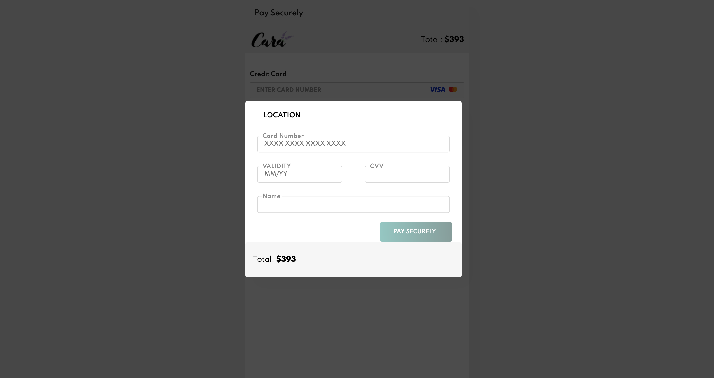
<li><h3><a href="#">404</a></h3></li>
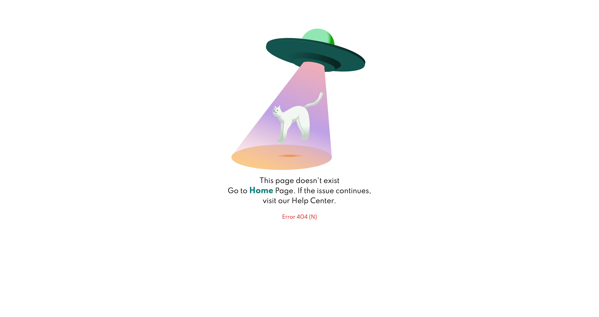
</ul>
</section>

<section>
			<h2>Authentication and Authorization System</h2>
			
The authentication and authorization system ensures that users can securely access their personal information and make purchases. Users can create accounts, log in, and manage their personal information and order history.

<h3>Pages</h3>
<ul>
<li><h3><a href="#">Sign up</a></h3></li>
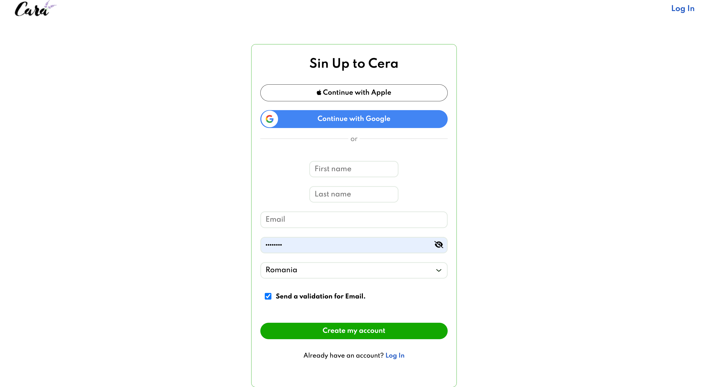
<li><h3><a href="#">Log in</a></h3></li>
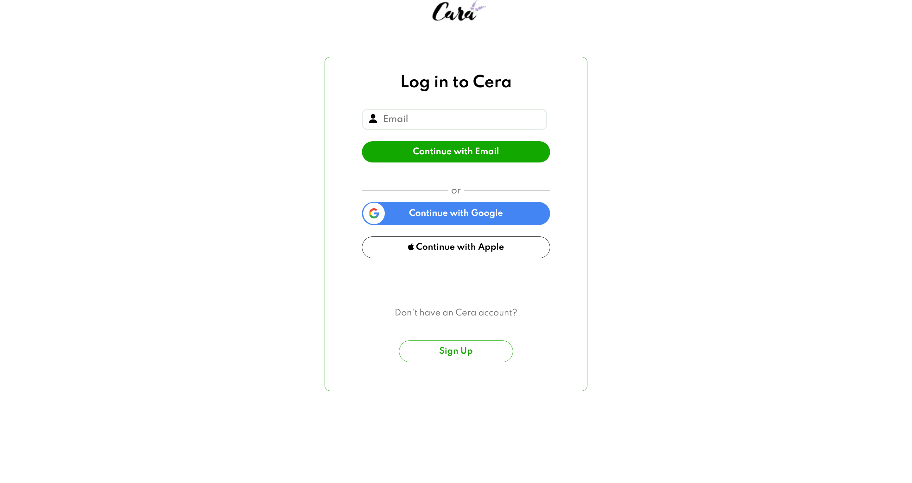
<li><h3><a href="#">Verify</a></h3></li>
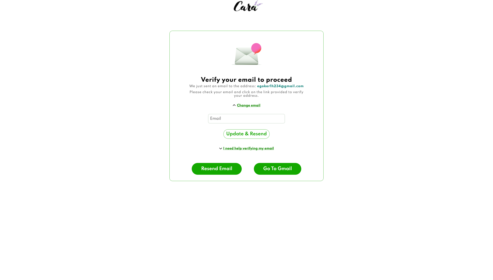
<li><h3><a href="#">Forget Password</a></h3></li>
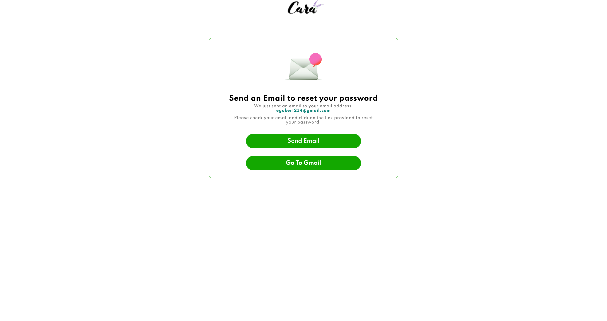
</ul>
		</section>
<section>
<h2>Account</h2>
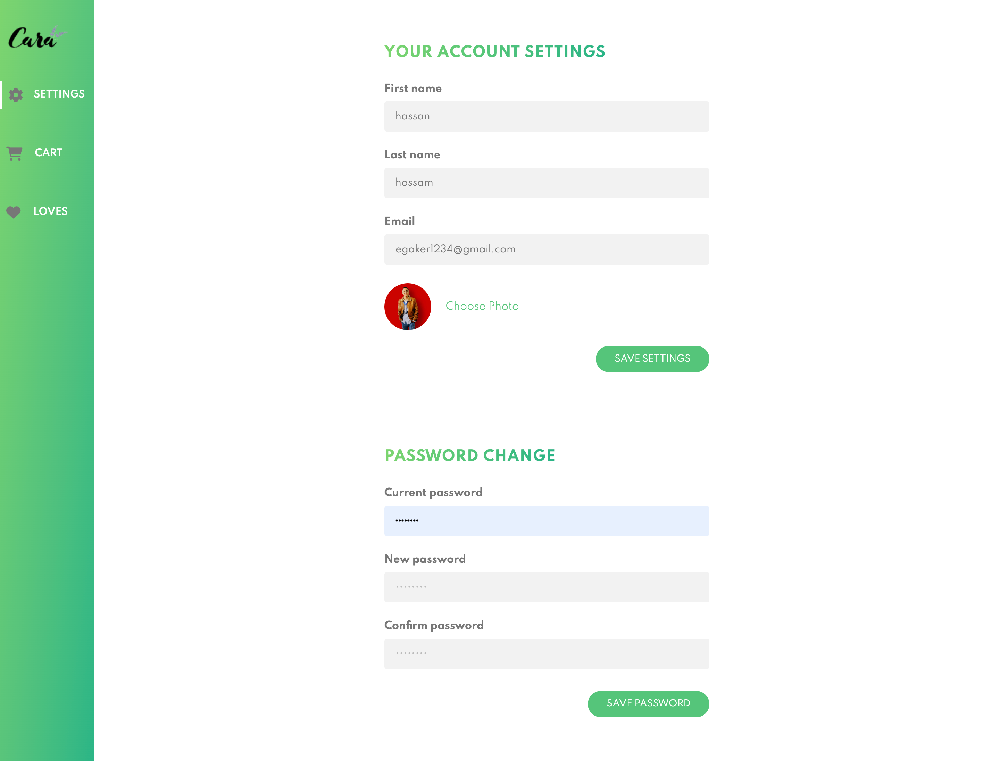
			<h2>Cart Part</h2>
			
The cart part of the website allows users to add products to their cart and manage their purchases. Users can view the contents of their cart, update quantities, and remove items.

      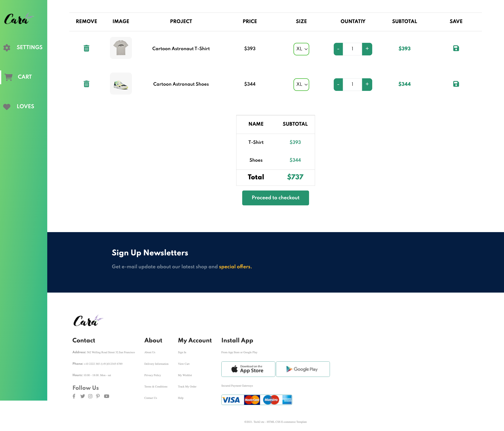
		</section>
<section>
			<h2>Love Part</h2>
			
The love part of the website allows users to "like" or "favorite" products that they are interested in. This feature helps users keep track of products they may want to purchase in the future.

      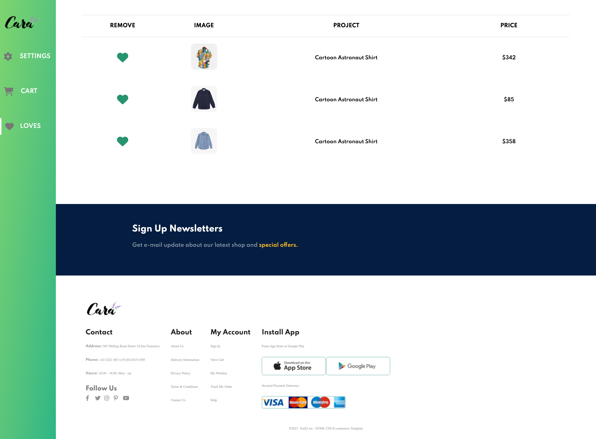
		</section>
<section>
			<h2>Technologies Used</h2>
			<ul>
				<li>HTML</li>
				<li>CSS</li>
				<li>JavaScript</li>
				<li>EJS</li>
				<li>REST API</li>
				<li>Node.js</li>
				<li>Node Mailer</li>
				<li>Express</li>
				<li>MongoDB</li>
				<li>Mongoose</li>
			</ul>
		</section>

<section>
			<h2>Installation</h2>
			
You must put your mongodb link, port and some secure Keys
			<ol>
				<li>Clone this repository</li>
				<li>Install dependencies using <code>npm install</code></li>
				<li>Start the server using <code>npm start</code></li>
			</ol>
		</section>
<section>
			<h2>Contributors</h2>
			
This e-commerce website was developed by <a href="mailto:7hassan.dev@gmail.com">Hassan Hossam </a>. If you would like to contribute to this project, please feel free to submit a pull request or contact Your Name for more information.

		</section>

<section>
			<h2>License</h2>
			
This project is licensed under the MIT License. See the <code>LICENSE</code> file for details.

		</section>
</main>

<footer>
	
&copy; 2023 E-commerce Website. All rights reserved.

</footer>
